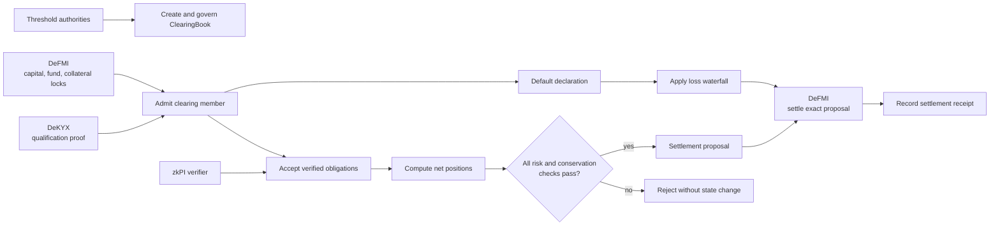
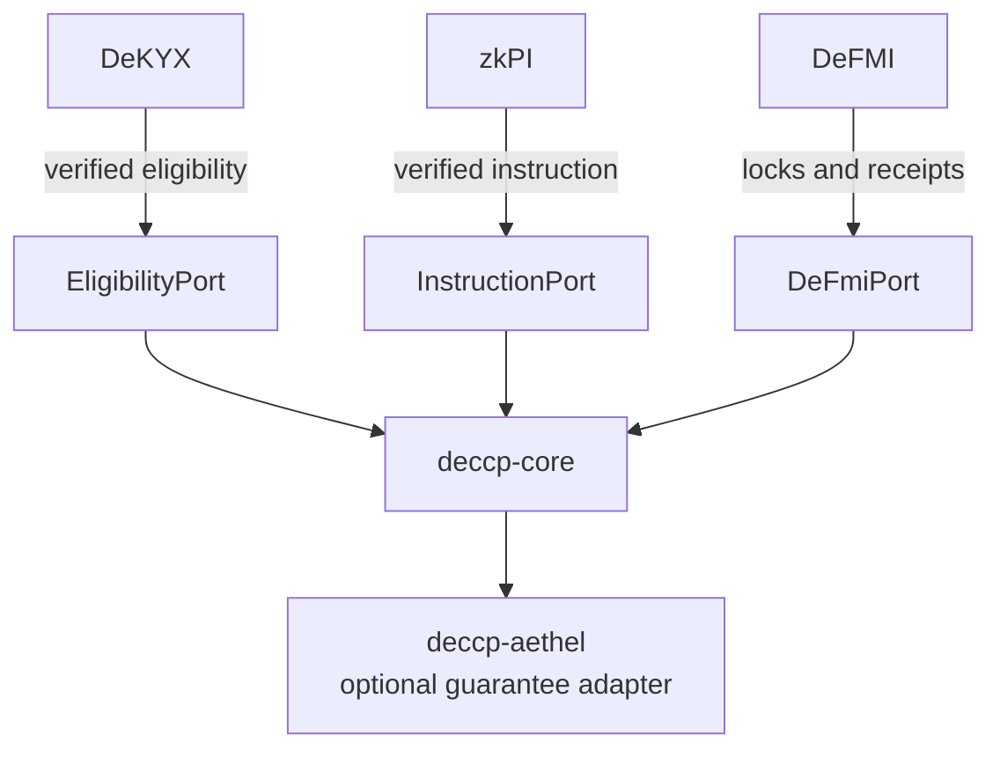

# DeCCP — Decentralized Central Counterparty

DeCCP is a deterministic clearing and risk state machine for a decentralized
central counterparty.

“Central” describes the logical role: obligations are accepted, netted,
guaranteed, and resolved through one authoritative clearing state.
“Decentralized” describes control: material changes require a threshold of
independent authorities, and settlement is verified against DeFMI rather than
trusted to one operator.

This repository provides reusable Rust crates. It does not custody assets and
is not, by itself, a licensed clearing house. It is a research implementation
and has not been audited for production use.

## What DeCCP provides

- Threshold-governed clearing-book creation and policy changes.
- Qualification-backed admission and lifecycle management of clearing members.
- References to DeFMI-backed CCP capital, default funds, and collateral lots.
- Initial and variation margin state.
- Clearing cycles with Gross-Gross, Gross-Net, and Net-Net modes.
- Deterministic multilateral netting with conservation checks for every asset.
- Public-value and confidential guarantee facilities.
- Atomic reservation, binding, release, and claim of guarantee capacity.
- Default declaration and a deterministic loss waterfall.
- Validated snapshots, replay recovery, and authenticated-state restoration.
- Explicit ports for qualification, zkPI verification, and DeFMI receipts.

## Clearing flow



DeCCP advances a final clearing or default state only when a DeFMI receipt is
bound to the exact proposal or waterfall context.

## Main capabilities

### Member admission and margin

Member admission requires threshold approval, a verified eligibility result,
and a live DeFMI default-fund lock. DeCCP records a scoped subject line, not a
legal name. Capital, default-fund, and collateral lock identifiers must be
unique, preventing one external lock from backing multiple risk positions.

Margin changes and material cycle controls are threshold-approved. Every net
risk debit must fit inside the participant's encumbered margin or the close
operation is rejected.

### Multilateral netting

DeCCP supports three modes:

| Mode | Result |
|---|---|
| `GrossGross` | Keeps each settlement leg and measures payer risk on a gross basis |
| `GrossNet` | Nets the designated settlement asset while retaining other gross legs |
| `NetNet` | Nets every asset across the cycle |

For every asset, the sum of net positions must remain zero. The resulting
proposal has a canonical digest so the settlement receipt cannot be moved to a
different cycle or set of legs.

### Guarantee facilities

The public-value path tracks facility capacity, reserved capacity, consumed
capacity, and individual holds. Compare-and-swap sequence checks prevent two
concurrent requests from spending the same remaining capacity.

The confidential path stores a coverage commitment and a DeFMI state digest,
not a plaintext amount. Reserve, release, and claim operations name the prior
sequence and digest. The DeFMI adapter must verify the hidden amount relation,
capacity bound, transition proof, and final receipt before DeCCP advances the
state.

The `deccp-aethel` crate maps Aethel guarantee lifecycle events to these
confidential hold transitions without importing Aethel's domain crate.

### Default waterfall

A default case records the triggering evidence, the available defaulter
resources, mutualized layers, CCP contribution, and the resulting draws. A
resolution requires threshold approval and a DeFMI receipt for the exact
waterfall context. A partial or mismatched receipt cannot finalize the case.

## Security and state invariants

Every accepted path checks the invariants relevant to it:

- Threshold approvals are bound to a canonical operation digest.
- Member subject lines, external locks, obligations, facilities, and holds are
  unique in their required scope.
- Incoming obligations must pass `InstructionPort`; a non-zero digest alone is
  not treated as a valid zkPI.
- Net positions conserve each asset exactly.
- Margin and guarantee reservations cannot exceed available capacity.
- Expired, released, or consumed holds cannot be claimed again.
- Settlement and default receipts must name the exact proposal context.
- Invalid operations fail without partially updating clearing state.

## Persistence and recovery

`ClearingBook` is not directly deserializable because unchecked restoration
would bypass quorum, qualification, and settlement validation. Two supported
recovery models are available:

1. Replay verified operations into a new book.
2. Restore a `ClearingSnapshot` after validating its canonical digest,
   authority set, approval, and all structural invariants.

`restore_authenticated` may be used only when the host storage already commits
to the exact snapshot bytes, such as consensus state protected by a state root.
It skips a second snapshot signature, not the structural validation.

## Dependencies and integration

DeCCP's product boundary is independent of the systems connected to its ports.



| Module | Relationship |
|---|---|
| `deccp-core` | Standalone clearing and risk state machine; no dependency on Aethel, DeKYX, zkPI, or DeFMI crates |
| `deccp-aethel` | Optional adapter built only on `deccp-core` |
| DeKYX | A host implements `EligibilityPort` to admit qualified members |
| zkPI | A host implements `InstructionPort` to validate obligations before netting |
| DeFMI | A host implements `DeFmiPort` to verify external locks, holds, and settlement receipts |
| Aethel | A host composes Aethel with `deccp-aethel` for receivable guarantees |

This port design lets a deployment replace the credential scheme or settlement
network without weakening DeCCP's internal invariants.

## Repository layout

```text
crates/
├── deccp-core/     Clearing, margin, netting, guarantees, defaults, snapshots
└── deccp-aethel/   Optional adapter for Aethel guarantee lifecycle events
```

## Enterprise PoC

[Enterprise PoC guide (Japanese)](docs/ENTERPRISE_POC_JA.md) covers role
separation, concurrent guarantee reservations, clearing, margin, default,
recovery, evidence retention and acceptance criteria.

## Build and verification

Run the checks on Linux with the locked dependency graph:

```sh
cargo test --workspace --locked
cargo clippy --workspace --all-targets --locked -- -D warnings
cargo fmt --all -- --check
cargo build --workspace --release --locked
```

The published revision passed these four gates. Production use additionally
requires independent review of the cryptography, margin model, default rules,
governance, operational recovery, and applicable clearing regulation.
