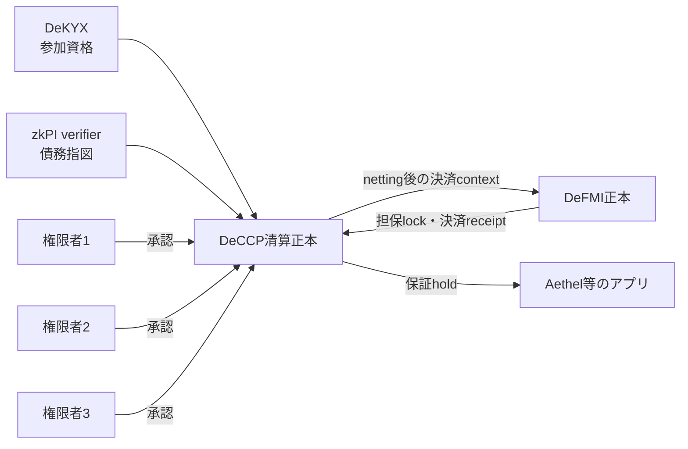

# DeCCP 企業向けPoC導入ガイド

## このPoCで確認すること

DeCCPは、清算参加者、証拠金、担保参照、保証枠、債務、ネッティング、破綻処理を
一つの検証可能な清算状態として扱うDecentralized Central Counterpartyである。
「Central」は清算上の単一正本を意味し、「Decentralized」は重要変更を単独運営者へ
委ねず、複数権限者の承認とDeFMI受領証で確定することを意味する。

PoCでは次を確認する。

- 参加者登録とpolicy変更に必要数の権限者承認がある。
- DeKYX適格性とDeFMI担保lockを確認してから参加を認める。
- zkPIを外部検証してから債務を清算対象へ入れる。
- 総額・差額ネッティングが資産別に保存則を満たす。
- 同時要求の合計が保証枠を超えない。
- 破綻処理が定めた損失負担順に従い、DeFMI決済後だけ残高を変える。
- 認証済みsnapshotだけを復元し、改ざんを拒否する。古い正規snapshotへの巻戻しは、host側の
  単調checkpointと照合して拒否する。

DeCCPは資産を保管せず、法的な中央清算機関の認可や債務引受効果を自動的に作らない。
PoCでは架空の参加者、資産、証拠金、破綻事例を使う。

## 推奨する担当者

| 担当 | PoCでの役割 |
|---|---|
| 清算業務担当 | 参加条件、清算周期、ネッティング方式、破綻手続きを定義する |
| リスク担当 | 証拠金、担保掛目、保証枠、損失負担順を承認する |
| DeKYX担当 | 清算参加資格の検証結果を提供する |
| DeFMI担当 | 担保lock、保証枠遷移、決済受領証を提供する |
| zkPI担当 | 入力債務の指図を検証する |
| 統治・監査担当 | 権限者集合、承認、snapshot、例外操作を監査する |

## 必要な環境

- インターネットへ公開しないLinux環境。
- Gitと、`Cargo.lock`を変更せず利用できるRust toolchain。リポジトリには
  `rust-toolchain.toml` がないため、PoC開始時の `rustc --version` を記録し、承認版を揃える。
  統合Docker buildが現在使う参照版はRust 1.97.1である。
- 架空の参加者、資産、債務、担保、保証、破綻シナリオ。
- PoC用のDeKYX、zkPI、DeFMI adapterまたは検証済みfixture。

## 1. ソースと基準試験を固定する

```sh
git clone https://github.com/shukob/deccp.git
cd deccp
git checkout <社内で承認したcommit>
git rev-parse HEAD

cargo test --workspace --locked
cargo clippy --workspace --all-targets --locked -- -D warnings
cargo fmt --all -- --check
cargo build --workspace --release --locked
```

## 2. 清算状態機械を一周させる

ネッティング、必要承認、証拠金上限、DeFMI受領証までの基準事例を実行する。

```sh
cargo test --locked -p deccp-core --test clearing \
  netting_is_conserving_quorum_approved_and_margin_bounded \
  -- --exact --nocapture
```

総額決済を選ぶ場合は、gross-grossの基準事例も実行する。

```sh
cargo test --locked -p deccp-core --test clearing \
  gross_gross_mode_preserves_each_leg_and_requires_gross_margin \
  -- --exact --nocapture
```

テスト内のport実装はPoC用fixtureである。これだけでは実DeKYX、実zkPI検証、
Avalanche上のDeFMI正本を確認していない。

## 3. 清算policyを固定する

次を版管理された設定として定義する。

- clearing book ID、対象資産、営業日・時刻基準。
- 権限者集合と、操作別の必要承認数。
- DeKYXの参加資格scopeとpolicy。
- Gross-Gross、Gross-Net、Net-Netのどれを使うか。
- 初期・変動証拠金、担保掛目、集中上限。
- 保証枠の提供者、上限、期限、更新条件。
- 清算周期、債務受付締切、決済期限。
- 破綻認定証拠と、証拠金、参加者基金、CCP資本の損失負担順。
- snapshot、replay、監査記録の保存期間。

計算結果を見てからネッティング方式や証拠金式を切り替えない。変更は次のcycleから
有効になる版付きpolicyとして承認する。

## 4. 外部portを実装する

DeCCP coreは外部システムを直接所有せず、検証結果をport経由で受け取る。

- `EligibilityPort`: DeKYXの清算参加資格を検証する。
- `InstructionPort`: 入力zkPIが対象cycleと債務へ結ばれているか検証する。
- `DeFmiPort`: 担保lock、保証枠遷移、清算・破綻決済の受領証を検証する。

本番に近いPoCでは、常に成功を返すfixtureを禁止し、別プロセスのDeKYX、zkPI verifier、
DeFMI RPCから取得した証拠を検証する。DeCCPには法的氏名、秘密鍵、資産残高の正本を
複製せず、検証済み参照と清算状態だけを保存する。

## 5. 参加者登録から決済まで

1. 複数権限者でclearing bookを作る。
2. DeKYX適格性とDeFMI default-fund lockを伴う参加申請を提出する。
3. 担保lot、初期証拠金、変動証拠金を登録する。
4. 外部検証済みzkPIを参照する債務を受付ける。
5. cycleを締め、選択した方式で資産別net positionを計算する。
6. 証拠金と担保の範囲内であること、資産別合計がゼロであることを確認する。
7. DeFMIへ決済し、正しいcontextの受領証を取得する。
8. 受領証を記録してcycleを確定する。

DeFMI受領証より先にDeCCPのcycleを決済済みにしない。

## 6. 保証枠と同時要求

公開額を扱うPoCでは通常の保証facility、金額を開かないPoCではcommitmentと
compare-and-swapを使うconfidential facilityを選ぶ。

```sh
cargo test --locked -p deccp-core --test clearing \
  concurrent_guarantee_reservations_use_one_sequence_and_never_exceed_capacity \
  -- --exact --nocapture

cargo test --locked -p deccp-core --test clearing \
  confidential_guarantees_use_commitment_cas_without_opening_amounts \
  -- --exact --nocapture
```

秘密型の同時予約は同じ `expected_facility_state_digest` と
`expected_facility_sequence` へ競合させ、一件だけが成功し、後続は再読込して再計算する。
公開型は `expected_facility_sequence` と公開残額を使う。アプリケーションのメモリ内残高だけで
上限を判断しない。

## 7. 破綻処理

```sh
cargo test --locked -p deccp-core --test clearing \
  default_waterfall_draws_margin_then_member_funds_then_ccp_capital \
  -- --exact --nocapture
```

PoCでは次を確認する。

- 破綻宣言では証拠と対象member/caseを同じ承認文へ結び、後続のresolutionで損失額と
  settlement contextを承認する。cycle IDは宣言statementのfieldではない。
- 破綻者証拠金、参加者基金、CCP資本の順序がpolicyどおりである。
- DeFMI決済が失敗した場合、内部残高だけを先に減らさない。
- 破綻中memberが新しい保証枠を予約できない。
- 期限切れholdをclaimできない。

## 8. snapshotと再起動

```sh
cargo test --locked -p deccp-core --test clearing \
  snapshot_restores_only_with_quorum_approval_and_intact_invariants \
  -- --exact --nocapture
```

単独DBに保存する場合は権限者quorumが承認したsnapshotを `restore` する。Avalanche VMなど
外側のconsensusがsnapshot bytesを状態根へ認証する場合だけ `restore_authenticated` を
使う。ファイルが読めたことを認証済みと解釈しない。

`restore` はtrusted authority set、署名quorum、内部不変条件を検証するが、現在稼働中のsequenceより
古い正規snapshotかどうかは判断しない。rollback拒否には§36のhost checkpointが必須であり、coreの
`restore` 単体の合格条件に含めない。

## 9. Aethel接続を確認する場合

`deccp-aethel` は、金額を平文で持たず、Aethel保証とDeCCP holdを結ぶadapterである。

```sh
cargo test --locked -p deccp-aethel --test adapter -- --nocapture
```

DeCCP coreへAethelの債権・stream状態を入れず、adapterがIDと検証文を対応づける。

## 10. 必須の拒否試験

- 未資格・停止中・破綻中memberの参加または新規取引。
- DeFMI担保lock不明、zkPI検証失敗、別cycleの指図。
- 不足承認、別権限者集合、古いpolicy版。
- 証拠金不足、担保集中上限、保証枠超過。
- 同じhold、obligation、cycle settlementの再送。
- 保存則を破るnet positionと、資産を混ぜた相殺。
- 古いfacility sequenceとcommitment。
- 期限切れholdのclaim。
- 改ざんsnapshot、およびhostの単調checkpointより古い正規snapshotへのrollback。
- DeFMI受領証のcontext、状態根、取引ID差替え。

## 11. 保存する証拠

- Git commit、Cargo.lock、Rust版。
- clearing policy、権限者集合、DeKYX scope、対象資産の版とSHA-256。
- cycleごとの入力債務digest、net position、保存則検査。
- 証拠金、担保、保証枠の前後状態とDeFMI receipt参照。
- 正常、同時競合、破綻、再送、snapshot復元の判定。
- DeFMI前後状態根と、DeCCP snapshot digest。

## 12. PoC合格条件

- 外部portの失敗時に清算状態を変えない。
- すべてのnetting modeで資産別保存則を満たす。
- 同時要求でも保証枠・証拠金・担保を超えない。
- cycleと破綻処理はDeFMI受領証後だけ確定する。
- coreがsnapshot改ざんを拒否し、hostの単調checkpointが古い正規snapshotへのrollbackを拒否する。
- DeCCPに法的身元、秘密鍵、資産残高の正本を複製しない。

## 本番移行前に別途必要なもの

- 中央清算機関としての法的構成、認可、債務引受、default rule。
- margin model validation、stress test、liquidity plan、default management exercise。
- 担保価格、掛目、集中、wrong-way risk、日中追加証拠金。
- 独立権限者、HSM、監査、BCP、サイバー対策。
- DeFMI、カストディ、決済銀行、参加者システムとの契約と運用試験。

ライブラリ試験の成功は、実際のCCP業務や規制要件を満たしたことを意味しない。

## 13. 実装の構成と限界

workspaceは二つのcrateからなる。

| crate | 責任 | 責任外 |
|---|---|---|
| `deccp-core` | 権限者、参加者、証拠金、担保参照、債務、ネッティング、保証、破綻、snapshot | 本人確認、資産正本、実際の送金 |
| `deccp-aethel` | Aethelの保証要求をDeCCP保証holdへ結ぶ | Aethel債権契約、DeFMI残高 |

現在のリポジトリは決定的なRust状態機械とadapter境界を提供する。完成済みの公開API、運営管理画面、
margin計算engine、価格配信、Avalanche node、HSM adapter、規制reportingは含まれない。企業PoCでは
この状態機械をDeFMI VM内または認証済みserviceへ組み込み、外部portを実装する。

## 14. CentralとDecentralizedの意味

DeCCPのCentralは、清算上のnovation、netting、margin、default waterfallが一つの論理正本に従うことを
意味する。各参加者が独自に債務残高を計算する構成ではない。

Decentralizedは、その正本を一人のoperatorの任意操作に委ねないことを意味する。重要操作は
`AuthoritySet` の複数署名、DeKYXの参加資格、zkPIの指図検証、DeFMIの資産lock・settlement receiptへ
依存する。



複数署名があるだけで運営主体が分散しているとは限らない。全鍵を同じ管理者・同じHSM・同じcloud
accountが持つ場合、実質的には単独障害である。PoC報告では台数だけでなく支配関係を示す。

## 15. 正本をどこへ置くか

構成は二つ考えられる。

### 15.1 DeFMI VM内

`ClearingSnapshot` をAvalanche上のDeFMI state rootへ含め、consensusで順序と永続性を認証する。
restore時は、hostがsnapshot bytesとstate rootの関係を検証した後に `restore_authenticated` を使う。

利点:

- 同時更新をchain順へ直列化できる。
- DeFMI asset stateと同じ確定文脈へ結べる。
- validatorが同じ状態機械を再実行する。

注意:

- block latencyが日中risk更新の遅延になる。
- 機密risk値をpublic stateへそのまま出さない設計が必要。
- VM upgradeとclearing rule変更を同時に管理する必要がある。

### 15.2 独立した認証済み清算service

複数権限者が承認したsnapshotを永続化し、DeFMIとはreceiptで結ぶ。復元時は `restore` を使い、trusted
authority setとsnapshot digestへのquorum署名を検証する。

利点:

- 高頻度のrisk更新をchainと分離できる。
- 清算参加者だけに詳細を公開しやすい。

注意:

- DB順序、leader、同時更新、rollback耐性を別途実装する。
- DeFMI receiptとsnapshot cutoffを原子的に結ぶ必要がある。
- 「ファイルを暗号化した」だけでは認証済みsnapshotにならない。

PoC開始時にどちらを正本とするかを一つ選ぶ。両方を同時に正本と呼ばない。

## 16. 使用技術

### 16.1 決定的Rust状態機械

`BTreeMap` と `BTreeSet` により順序を固定し、すべての算術をchecked operationで扱う。操作IDは一回だけ
使用し、再送による二重変更を防ぐ。失敗時に部分更新を残さない。

### 16.2 Ed25519複数署名

各権限者が同じstatement digestへ個別署名する。`QuorumApproval` はauthority epoch、statement digest、
署名者ID、署名を持つ。重複署名者、未登録者、不足数、別epoch、別statementを拒否する。

これはFROSTの一つの集約署名ではない。誰が承認したかを個別に検証する方式である。

### 16.3 hashによる文脈束縛

参加登録、margin更新、cycle開始、保証facility、破綻宣言など、操作ごとに異なるdomain文字列でdigestを
作る。同じ署名を別操作へ転用できないよう、ID、金額、期限、sequence、policyを含める。

### 16.4 外部port

coreはHTTPやchain RPCを直接呼ばない。`EligibilityPort`、`InstructionPort`、`DeFmiPort` というinterfaceを
通じて外部検証を要求する。実装者は、単に非ゼロIDを確認するのではなく、外部証明と正本readbackを
検証する。

## 17. 推奨ハードウェア

以下は開始値であり、保証値ではない。参加者数、obligation数、cycle頻度、保証hold数、snapshotサイズで
実測する。

### 17.1 最小機能確認

- 4 vCPU。
- メモリ8 GiB。
- SSD空き30 GiB。
- 64ビットLinux。

一process内のlibrary testは、分散権限、同時要求、外部DeFMI、災害復旧を証明しない。

### 17.2 企業PoCの独立service構成

| 役割 | 台数 | vCPU/台 | メモリ/台 | SSD/台 | 備考 |
|---|---:|---:|---:|---:|---|
| 清算state node | 3または5 | 8 | 32 GiB | 500 GiB | consensusまたは強いleader制御 |
| command gateway | 2 | 4 | 8 GiB | 100 GiB | idempotencyと認証 |
| risk/margin worker | 2以上 | 8 | 32 GiB | 200 GiB | modelは別版管理 |
| DeKYX/zkPI adapter | 2 | 4 | 8 GiB | 50 GiB | fail-closed cache |
| DeFMI adapter | 2 | 4 | 8 GiB | 100 GiB | receipt/readback検証 |
| reporting read model | 2 | 8 | 32 GiB | 1 TiB | 正本ではない |
| 監視・監査 | 1 | 8 | 32 GiB | 1 TiB | 保存期間に応じる |
| 負荷生成 | 1 | 16 | 32 GiB | 100 GiB | 本番nodeと分離 |

DeFMI VM内で動かす場合はDeFMI validator資源にstate/proof検証負荷を加える。清算serviceとrisk workerを
同じCPU quotaへ押し込むと、market stress時に必要な処理ほど遅くなるため、専用capacityを確保する。

現在のcoreはGPUを必須にしない。大量scenarioのmargin modelやstress testがGPUを使う場合も、coreの
正本更新とは別workerとして扱う。

## 18. OS、network、時刻

- 長期保守版の64ビットLinux。
- buildとruntime imageを分離。
- root実行を避ける。
- authority signer、clearing command、DeFMI adapter、reportingを別networkへ置く。
- 全service間をmTLSにし、service証明書とauthority署名鍵を分ける。
- NTPを複数sourceで同期し、ずれたnodeは承認から外す。
- private endpointを使い、DeFMI validator RPCをpublic internetへ直接出さない。

期限はeligibility、collateral valuation、guarantee hold、settlement receipt、business cycleに存在する。
各時刻の単位と基準をschemaへ明記し、Unix秒、Unix ns、block heightを混ぜない。

## 19. ソースと成果物を固定する

```sh
git clone https://github.com/shukob/deccp.git
cd deccp
git checkout <承認commit>
git rev-parse HEAD
sha256sum Cargo.lock
rustc --version --verbose
cargo metadata --locked --format-version 1 > poc-output/deccp-cargo-metadata.json
```

正式test/buildは承認済みremote Linuxで実行する。成果物に次を記録する。

- Git commitとdirty有無。
- Cargo.lock SHA-256。
- Rust toolchain、target、feature。
- service imageまたはVM binary digest。
- DeKYX、zkPI、DeFMI adapterの対応版。
- clearing policy bundle digest。
- authority set epochとdigest。

## 20. 権限者集合を設定する

`AuthoritySet` はepoch、threshold、member ID、Ed25519公開鍵を持つ。member ID重複、zero ID、無効公開鍵、
threshold超過を拒否する。

### 20.1 操作別の権限

coreの集合は一つでも、業務運用では操作別に承認policyを上位で制御する。

| 操作 | 推奨する承認者の例 |
|---|---|
| participant admission | 会員管理、risk、運営 |
| margin policy変更 | risk、model validation、運営 |
| cycle開始/締切 | operation、監視 |
| guarantee facility登録 | guarantor、risk、settlement |
| default宣言 | default committee、法務、risk |
| VM/snapshot復元 | technology、operation、監査 |

一人が複数member IDの鍵を操作できればthresholdの意味がない。鍵保有者、HSM partition、承認UI accountを
分ける。

### 20.2 epoch更新

新epochへ移る前に、進行中cycle、未決済hold、未完了default caseを一覧化する。旧epoch署名をどこまで
受けるか開始height/時刻を決める。snapshotのauthority setも同じepochへ結ぶ。

## 21. clearing policy bundle

最低限、次を一つの署名済みbundleにする。

```text
clearing_book_id
policy_version
authority_epoch
eligible_dekyx_policies
allowed_assets
cycle_calendar
netting_mode
margin_model_digest
collateral_valuation_policy_digest
concentration_limits
guarantee_policy_digest
default_waterfall_version
defmi_deployments
zkpi_domains_and_key_epochs
snapshot_policy
```

policyはcycle開始時に固定する。締め処理後に、結果が都合よくなるnetting modeやhaircutへ変えない。
変更は新cycleから有効にし、旧cycleは旧policy digestで再現できるようにする。

## 22. participant admission

参加申請には次が必要である。

- operation ID。
- DeCCP内participant ID。
- DeFMI側settlement participant ID。
- DeKYX eligibility attestation。
- default fund拠出額。
- DeFMI lock IDとproof digest。
- admission時刻。
- quorum approval。

処理順:

1. operation IDが未使用か確認する。
2. request形式、金額、期限を検査する。
3. DeKYX `EligibilityPort` でscope/policy/subject lineを検証する。
4. DeFMI `verify_default_fund` で実際のlockを確認する。
5. request statementへのquorum署名を検証する。
6. participantをActiveで登録し、operation IDを消費する。

DeCCPは法的氏名を保存せず、DeKYX subject lineを用いる。規制報告で実名が必要な場合は、issuerとの
権限付き対応表を別systemに置く。

### 22.1 停止と退出

Active、Suspended、Defaulted、Exitedを区別する。

- Suspended: 新規obligation/保証を止め、既存決済・解放を許すpolicyを定義。
- Defaulted: default waterfall以外の新規riskを禁止。
- Exited: 未決済cycle、hold、fund返還がないことを確認して終了。

`Suspended` と `Exited` は現在enumにはあるが、そこへ遷移させるcore operationは未実装である。
`declare_default` による `Defaulted` だけが実装済みである。停止・退出をPoC合格条件にする場合は、
quorum承認、未決済資源検査、DeFMI readbackを持つ状態遷移を追加する。statusをDBで直接書き換えて
代用しない。

## 23. collateralとmargin

### collateral lot

lotはowner、asset、DeFMI lock ID、市場価値、haircut basis points、valuation policy/proof digest、期限、状態を
持つ。eligible valueは次で計算する。

```text
eligible_value = market_value * (10,000 - haircut_basis_points) / 10,000
```

haircutは10,000未満でなければならず、overflowをchecked算術で拒否する。DeFMI adapterがlockのasset、
owner、amount、期限、state rootを検証してから登録する。

`CollateralStatus` には `Available`、`Released`、`Seized` が定義されているが、現在のcoreには
collateral lotを `Released` または `Seized` へ移すoperationがない。破綻時の担保処分を実行済みと
扱わず、DeFMI決済受領証に結ぶ遷移を別途実装してから受入対象にする。

### margin account

初期証拠金、変動証拠金、担保拘束額、sequenceを持つ。requiredは初期+変動である。更新には
`expected_sequence` とquorum approvalを使い、同時更新の一方だけを成功させる。

margin model自体はcoreの外で計算する。model ID、版、入力cutoff、market data digest、計算結果、承認文を
`MarginUpdate` へ結ぶadapterを作る。数字だけを手入力しない。

### 日中margin call

1. market data cutoffを固定する。
2. risk workerが必要額を計算する。
3. model validation ruleを通す。
4. quorum承認を得る。
5. DeFMIで追加担保をlockする。
6. margin sequenceを更新する。
7. participantへ期限付き通知する。

DeFMI lock前にDeCCP残高だけを増やさない。

## 24. obligation受付

`ClearingObligation` はoperation、obligation、cycle、payer、payee、asset、amount、risk value、zkPI digestを
持つ。payerとpayeeが同じ、zero額、未知cycle、停止member、重複IDは拒否する。

`InstructionPort` は次を確認する。

- zkPI署名とproof。
- application/domain/key epoch。
- payer/payee pseudonymの対応。
- assetとamount。
- cycle IDと期限。
- 指図が未使用であること、またはDeFMIで消費可能なこと。

DeCCPが `zkpi_digest != 0` だけで受理してはいけない。PoC fixtureの常時成功portを本番相当試験に使わない。

受付後、同じoperation IDとobligation IDを再度受理しない。message brokerのat-least-once deliveryを前提に、
同じbytesは既存結果へ収束させる。

## 25. netting mode

### 25.1 Gross-Gross

全obligation legを個別に残す。支払側は各gross legを満たす必要がある。流動性負担は大きいが、個々の
決済関係を保持する。

### 25.2 Gross-Net

現在の実装では、cycleの `settlement_asset_id` と同じassetだけをnetし、それ以外のassetは各legを
grossのまま残す。任意の「一方の側」やpolicyで選んだ軸をnetする実装ではない。別の定義が必要なら
mode名を流用せず、新しいschema・保存則・受入ベクトルを作る。

### 25.3 Net-Net

同一asset内でparticipantごとのnet positionを計算する。全payer amountと全payee amountが一致し、資産を
またいだ相殺をしない。

### 25.4 保存則

各assetについて次を確認する。

```text
sum(outgoing legs) == sum(incoming legs)
```

obligation rootはcycleに含まれる全入力を正規順でcommitする。netting proposalはmode、root、legs、risk debit、
proposal digestを持つ。入力を一件省略、重複、順番変更してもdigestが変わる。

## 26. cycleの完全手順

1. `OpenCycleRequest` をquorum承認し、mode、asset、policy、開始時刻を固定する。
2. Activeかつeligibleなmemberからobligationを受付ける。
3. 締切後に新規受付を停止する。
4. `prepare_close` でproposalを作る。
5. obligation rootと入力件数を独立再計算する。
6. asset別保存則、member status、margin上限を確認する。
7. proposal digestへquorum承認する。
8. `commit_close` でcycleをClosedへする。
9. 各legのinstruction contextからzkPIを作り、DeFMIへ決済する。
10. DeFMI receiptのcontext、finality、時刻を検証する。
11. `record_cycle_settlement` でSettledへする。
12. 正本snapshotとreporting read modelを更新する。

ClosedとSettledを一つの状態にしない。DeFMIが停止してもcycleはClosedで残り、再送・復旧できる。

## 27. 保証facility

保証には公開金額型と秘密金額型がある。

### 27.1 公開金額型

facilityはguarantor、beneficiary subject line、settlement asset、capacity、reserved、consumed、DeFMI facility ID、
policy、期限、sequence、statusを持つ。

利用可能額:

```text
available = capacity - reserved - consumed
```

すべてchecked算術で処理する。Active以外、期限切れ、guarantor default、上限超過は拒否する。

### 27.2 秘密金額型

DeCCPが持つのは一つの `capacity_commitment` と、不透明な最新
`latest_facility_state_digest` であり、reserved/consumedそれぞれのcommitmentは保持しない。
更新は公開sequenceと、前state digestから後state digestへのcompare-and-swapへ結ぶ。

DeCCP core自身は `relation_proof_digest` が非zeroであること、前後state digestが異なること、
`expected_facility_state_digest` と `expected_facility_sequence` が現在値へ一致することを確認する。
証明内容とDeFMI状態遷移の検証は `DeFmiPort` に委ねる。現在のtest fixtureは主にstate digestと
時刻を確認するだけなので、実DeFMI adapterで関係証明を検証する試験なしに「秘密枠を暗号的に
検証済み」と報告しない。

### 27.3 hold lifecycle

```text
Reserved -> Bound -> Consumed
Reserved ------------> Released
Bound ----------------> Released
```

- Reserved: facility capacityを仮押さえした。
- Bound: 特定exposureへ結んだ。
- Consumed: default等で保証を実行し、DeFMI receiptを得た。
- Released: exposure不成立・終了によりcapacityへ戻した。

claimはBound後だけ許す。一方releaseはReservedとBoundの両方から到達できる。
Consumed/Releasedを再利用しない。期限後のclaimを拒否する。

## 28. 同時保証要求と枠超過防止

複数アプリ、複数wallet、複数RFQが同じbeneficiaryへ同時要求する場合、application memoryの残額ではなく
facility正本で直列化する。

公開型:

1. current sequenceとavailableを読む。
2. requestへexpected sequenceを入れる。
3. DeFMI holdを作る。
4. DeCCPがsequenceと合計を一つのtransactionで比較・更新する。
5. 同じsequenceを使った二件目は失敗し、最新状態から再計算する。

秘密型:

1. current sequenceとcommitment stateを読む。
2. requested amountの関係proofを作る。
3. expected before commitmentとafter commitmentをrequestへ入れる。
4. DeFMIがproofとCASを正本で実行する。
5. receipt確認後にDeCCP holdを登録する。

一つの主体が複数credentialを得るSybil対策には、DeKYXのbeneficiary subject lineをfacilityへ固定する。
wallet IDでは集約しない。

## 29. Aethel保証接続

`deccp-aethel` は、Aethelの支払stream/債権とDeCCPの保証facility/holdをIDとdigestで結ぶ。

完全経路:

1. Aethelが匿名subject lineと保証要求を作る。
2. DeKYXが資格を検証する。
3. adapterがguarantee ID、request ID、series ID、stream state version/root、coverage commitment、
   loss layer、guarantee terms、claim policyをpurpose digestへ結ぶ。任意の
   `credit_decision_id` はbindingには残るが、現在のpurpose digestには含まれないため、別の与信判断へ
   差し替えられないことをhost側でも検査する。
4. DeCCPがconfidential guarantee holdを予約する。
5. AethelはDeFMI hold IDとcoverage commitmentなどのopaqueな保証bindingを保存する。DeCCPの
   検証済みreceipt自体をAethelが所有する構成ではない。
6. 債権不成立なら、release側のDeFMI settlement digestを検査してcapacityを戻す。
7. defaultなら、claim側のDeFMI settlement digestを検査してConsumedへする。

Aethelは保証残額の正本を持たず、DeCCPは支払stream契約の正本を持たない。両方へ同じ平文金額を複製
して同期させる構成にしない。

## 30. default宣言

defaultは管理画面の一クリックで即時確定させない。現在の宣言statementが束縛するのは
`operation_id`、`case_id`、evidenceの `event_id`、`source_id`、`participant_id`、
`event_digest`、`observed_at`、宣言時刻 `now` である。損失額とcycle IDはdefault宣言には含まれず、
後続の `prepare_default_resolution` で損失配賦とsettlement contextへ結ぶ。宣言statementが
loss/cycleまで直接認可すると誤解しない。

宣言時:

- memberが存在し、既にExited/Defaultedでない。
- operation/case IDが未使用。
- evidenceがzeroでない。
- authority epochと署名が正しい。
- 対象時点のsnapshot/policyが固定されている。

承認後、participantをDefaultedにし、新規obligationと保証予約を止める。既存settlement、hold、collateralは
default caseの規則で処理する。

## 31. default waterfall

現在の基本順序は次である。

1. 破綻者のmargin。
2. 破綻者のdefault fund。
3. 他memberの共同default fund。
4. CCP capital。

`prepare_default_resolution` はlossをこの順で割り当て、`WaterfallDraw` の列を作る。資源が足りなければ
`WaterfallExhausted` として確定しない。

重要なのはprepareとcommitの分離である。

1. resolution案を作る。
2. draw順、amount、source IDを独立検査する。
3. DeFMIへ実資産移転を指図する。
4. 正しいcontextのfinal settlement receiptを受ける。
5. `commit_default_resolution` で内部残高を減らしcaseを完了する。

DeFMIが失敗した場合、DeCCP内部だけでfundを消費しない。逆にDeFMIが確定した後でDeCCP更新を失った
場合、receipt inboxと正本readbackから冪等に再適用する。

本番では、CCP skin-in-the-gameの順、assessment、recovery tool、variation margin gains haircut等を法的ruleへ
合わせる必要がある。現在の四段階が全法域の正式waterfallであるとは扱わない。

## 32. DeFMI portを正しく実装する

`DeFmiPort` の各methodは実際の正本を確認する。

- CCP capital lock。
- participant default fund lock。
- collateral lot lock。
- 公開/秘密guarantee facility。
- guarantee hold、release、claim。
- cycle settlement。
- default resolution settlement。

adapterが検証すべき項目:

- 対象DeFMI deployment/domain。
- transaction/block/height。
- before/after state root。
- resource IDとowner/beneficiary。
- assetとcommitment。
- operation nullifier。
- context digest。
- finality条件と時刻。

HTTP 200や非ゼロreceipt IDだけを成功条件にしない。indexer行ではなくcanonical readbackまたは検証済み
facility receiptを使う。

## 33. zkPI portを正しく実装する

`InstructionPort::verify_obligation` は、基本wire decodeだけでなく署名、proof、domain、deadline、asset、party、
amount、cycleを確認する。zkPIの解析成功を検証成功として扱わない。

netting後の各 `ClearingLeg` にはexact public `instruction_context_digest` がある。zkPI builderはこのdigestを
署名対象へ入れる。これにより、同じnet額を別cycle、別payer、別assetへ移せない。

zkPIのnullifier消費は最終的にDeFMI正本で行う。DeCCPのused operation集合だけで資産二重使用を防いだと
しない。

## 34. DeKYX portを正しく実装する

`EligibilityPort` はDeKYXのissuer directory、status list、anonymous proof、replay contextを検証し、
`VerifiedAdmission` を返す。

確認するもの:

- issuer/provider ID。
- subject line ID。
- clearing participation policy digest。
- evidence/proof digest。
- valid until。

`VerifiedAdmission` 自体に `subject_kind` fieldはない。法人等の許可種別であることは
`EligibilityPort` がDeKYX証拠を検証する際に確認し、返却値だけを後から見て再判定しない。

参加時に有効でも、長期cycle中に資格が失効する場合がある。新規obligation受付時、margin返還時、退出時の
どこで再検証するかをpolicyにする。

## 35. queue、outbox、冪等性

状態を次のように分ける。

```text
participant_pending -> admitted
cycle_open -> closing -> closed -> settlement_submitted -> settled
hold_requested -> reserved -> bound -> consumed | released
default_proposed -> declared -> resolution_prepared -> settlement_submitted -> resolved
```

各外部呼出しにoutboxを使う。

- DeFMI lock作成。
- zkPI検証または発行。
- settlement transaction送信。
- receipt/readback取込。
- participant通知。

outbox rowと内部状態を同じDB transactionで保存する。broker送信だけ成功してDB更新が失敗しても、同じ
operation IDとbytesで再送できるようにする。

DeFMI response timeout時は新規settlementを作らず、transaction ID/context/nullifierを正本検索する。

## 36. snapshotと復旧

`ClearingSnapshot` はauthority、participant、collateral、margin、cycle、obligation、公開/秘密guarantee、default、
CCP capital、used operationを含む。

### 独立service

1. snapshot bytesを正規serializeする。
2. digestを計算する。
3. current authority quorumがdigestへ署名する。
4. snapshot、approval、policy digest、連番を不可分に保存する。
5. restore時にtrusted authority setを外部設定から渡す。
6. quorum署名を検証する。
7. 全内部不変条件を再検査する。

### DeFMI VM内

hostがsnapshot bytesをaccepted state rootへ結ぶことを検証する。その場合だけ
`restore_authenticated` を使う。ローカルfile checksumだけでは不十分である。

### rollback防止

snapshot sequence、DeFMI height、latest settled cycle、used operation rootを外部の単調checkpointへ結ぶ。
古いsnapshotが署名済みでも、現在より前なら稼働系へ戻さない。

## 37. reportingと監査

read modelへ次を投影する。

- participant statusと資格期限。
- cycle status、mode、入力件数、obligation root。
- asset別gross/net amount。
- margin required/posted/shortfall。
- collateral価値、haircut、期限、集中。
- guarantee capacity/reserved/consumed/availableまたはcommitment state。
- default case、waterfall draw、settlement receipt。
- authority approvalとpolicy version。

read modelは正本でなく、消してsnapshot/eventから再構築できるようにする。秘密facilityの平文amountを
reporting都合で復号・保存しない。必要な監査者へはDeFMIのscope view/開示手順を使う。

## 38. 監視

### 清算状態

- open/closing/closed/settled cycle数と滞留時間。
- obligation受付数、拒否数、重複数。
- asset別保存則check失敗。
- margin shortfallと期限超過。
- guarantee holdの状態別件数と期限。
- default caseの段階別滞留。
- used operation増加と重複拒否。

### 外部依存

- DeKYX status ageと検証error。
- zkPI verification latency/error。
- DeFMI lock/settlement/readback latency。
- validator height/root不一致。
- outbox最古経過時間。

### 基盤

- CPU、RSS、disk、DB lock、fsync。
- snapshotサイズ、作成時間、quorum署名時間。
- authority signer availability。
- clock skew。

metric labelへparticipant ID、subject line、obligation IDを無制限に入れない。高cardinality値は保護された
audit logへ置く。

## 39. 性能測定

工程を分ける。

1. participant admissionと外部port検証。
2. obligation受付。
3. 1 cycleあたりのprepare_close。
4. netting mode別proposal作成。
5. margin/collateral検査。
6. authority署名検証。
7. DeFMI settlementとreadback。
8. guarantee reserve/bind/release/consume。
9. default resolution。
10. snapshot、digest、restore validation。

代表条件:

- participant 10、100、1,000。
- obligation 100、1万、10万/周期。
- asset 1、10、100。
- Gross-Gross、Gross-Net、Net-Net。
- 同一facilityへの集中要求と多数facility分散。
- defaultなし、1member default、複数default。
- snapshot小、中、最大想定。
- DeFMI正常、遅延、停止。

throughputだけでなく、p50/p95/p99、最大、失敗率、CPU、RSS、snapshot bytes、DB I/O、DeFMI finalityを
記録する。stress時ほどmargin/default処理が増えるため、平常時平均だけでcapacityを決めない。

## 40. 障害注入

| 障害 | 期待する挙動 | 証拠 |
|---|---|---|
| authority一人停止 | thresholdを満たせば継続 | signer集合とapproval |
| threshold未満 | 重要操作を停止 | state root/snapshot不変 |
| DeKYX停止 | 新規admissionを停止 | 既存決済をpolicy通り継続 |
| zkPI verifier停止 | 新規obligationを受付けない | cycle入力不変 |
| DeFMI停止 | Closedで待機 | Settledへ進まない |
| receipt response喪失 | 正本readbackして収束 | 二重settlementなし |
| DB leader切替 | 同じsequenceを二重成功させない | operation一意性 |
| 同時margin更新 | 一件だけ成功 | sequenceが1だけ増える |
| 同時guarantee予約 | capacity超過なし | reserved/commitment CAS |
| snapshot改ざん | restore拒否 | 稼働状態を置換しない |
| 古い正規snapshot | host checkpointでrollback検知 | latest cycle/operation維持 |
| default中に再起動 | 同じresolutionから再開 | waterfall二重drawなし |

## 41. security確認

### authority

- member鍵を異なる管理者/HSMへ分ける。
- 同じstatement digestを人が読める要約と照合する。
- epoch、policy、開始時刻を署名画面へ表示する。
- blind signingを禁止する。
- 鍵漏洩時のmember除外とepoch更新を演習する。

### state

- operation IDを一度だけ消費する。
- expected sequenceを全競合resourceに持つ。
- failure時にclone/rollbackされた部分stateをcommitしない。
- checked算術を使う。
- snapshot deserialize後に `validate` を必ず通す。

### external ports

- test fixtureをproduction buildへ混ぜない。
- timeoutを成功に変換しない。
- cache期限とsource state rootを確認する。
- HTTP/TLS成功でなく暗号receiptを検証する。
- DeFMI indexerとcanonical stateを区別する。

### privacy

- confidential guarantee openingをDeCCPへ渡さない。
- DeKYX credential原文を保存しない。
- application固有の債権明細をcoreへ入れない。
- logsへmargin/保証額を不用意に出さない。
- reporting権限をroleとscopeで限定する。

## 42. 業務継続と災害復旧

RPO/RTOを次の系統ごとに決める。

- clearing正本。
- authority signer。
- DeKYX directory/status。
- zkPI trust store。
- DeFMI validator/readback。
- outbox/inbox。
- reporting read model。

復旧演習:

1. 正常snapshotとquorum approvalを取得する。
2. 稼働系を停止し、別環境へrestoreする。
3. latest settled cycle、used operation、guarantee sequence、default caseを比較する。
4. DeFMIの同じheight/rootと照合する。
5. 既存settlementを再送し、二重処理されないことを確認する。
6. 新cycleを開始し、正常に確定させる。

reporting DBだけ復元できても業務復旧ではない。authority quorumまたはDeFMI readbackがない場合、
未確認状態で新規清算を再開しない。

## 43. よくある障害と切り分け

### `InsufficientQuorum`

署名数、member重複、authority epoch、statement digestを確認する。別操作の署名を使い回さない。

### `EligibilityRejected`

DeKYX issuer/status/scope/policy/contextのどれが拒否されたかをadapter reason codeで確認する。credential原文を
DeCCP logへコピーしない。

### `InstructionRejected`

zkPI domain、deadline、asset、party、cycle binding、key epochを比較する。wire parse成功だけで受理しない。

### `InsufficientMargin`

`prepare_close` でcycleのrisk debitが記録済みmarginを超えた場合に返る。cycleのobligation、mode、
risk value、margin cutoffを同じpolicy版で比較し、古いread modelだけを見ない。

### `InsufficientCollateral`

`set_margin` でinitial marginとvariation marginの合計がeligible collateralを超えた場合に返る。
collateral lot、haircut、valuation期限、owner、DeFMI lockを確認する。margin不足と担保登録不足を
同じ原因として扱わない。

### `GuaranteeCapacityExceeded`

current sequence、reserved、consumed、進行中hold、DeFMI state rootを確認する。同時要求の敗者なら最新状態
から再計算する。上限を増やして自動再試行しない。

### `GuaranteeHoldUnavailable`

holdがBound/Consumed/Releasedのどれか、期限、exposure ID、guarantor statusを確認する。期限切れを管理APIで
強制claimしない。

### `InvalidSettlementReceipt`

expected context、DeFMI deployment、receipt key/committee、block/height、before/after rootを確認する。indexer
responseをreceiptとして使っていないか調べる。

### `WaterfallExhausted`

損失額が全資源を超えている。内部残高を負にせず、recovery/resolution手続へ上げる。policyを後付けで
変えて同じcaseを確定しない。

### snapshot restore失敗

trusted authority set、snapshot authority epoch、quorum signature、内部不変条件、最新checkpointを確認する。
失敗snapshotを部分修正して正本へ戻さない。

## 44. 段階的PoC

### 段階A: core状態機械

- participant、collateral、margin。
- 三つのnetting mode。
- 公開/秘密guarantee。
- default waterfall。
- snapshot改ざん拒否。

### 段階B: service分離

- 3または5清算node。
- 独立authority signer。
- command gateway、outbox、read model。
- leader失敗とrestore。

### 段階C: 実port統合

- DeKYX匿名参加資格。
- zkPI obligation検証。
- DeFMI collateral/fund/facility lock。
- final settlement receiptとcanonical readback。

### 段階D: application統合

- Aethel confidential guarantee。
- QOMM取引のnovation/netting。
- OCLOB約定のclearing。
- 複数applicationが同じ法人facilityへ競合する試験。

### 段階E: stress/default exercise

- 大規模cycle。
- market data急変と日中margin call。
- participant default。
- authority/DeFMI障害。
- 災害復旧とregulatory report再構築。

## 45. 最終提出物

- commit、Cargo.lock、compiler、binary/image digest。
- 清算正本、authority、DeKYX、zkPI、DeFMIのnetwork図。
- 各hostのCPU、memory、disk、OS、region、管理主体。
- clearing policy、margin model、haircut、default ruleの版とdigest。
- authority ceremony、epoch更新、署名者分離の記録。
- participant admissionとDeKYX evidence digest。
- cycleごとのobligation root、netting proposal、asset別保存則。
- margin/collateralの前後、DeFMI lock/readback。
- 同時guarantee予約とcapacity超過防止の正本証拠。
- default declaration、waterfall、DeFMI settlement receipt。
- snapshot digest、quorum approval、restore/rollback試験。
- p50/p95/p99、throughput、failure率、snapshot/state成長。
- 障害注入と災害復旧の結果。
- 法的CCP機能、認可、外部market data、HSMなど未実装の一覧。

PoC結果は、中央清算機関としての免許、法的novation、倒産隔離、参加者契約、規制承認を代替しない。
